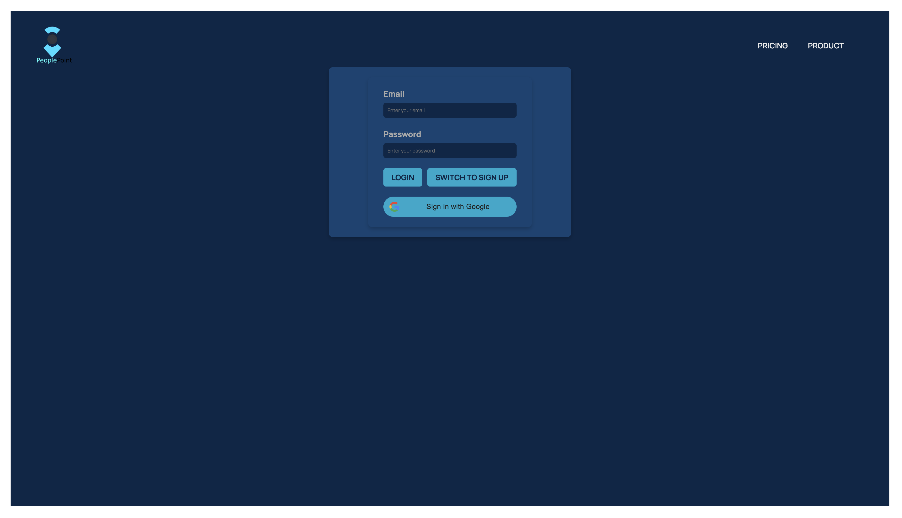

# Travel Planner

A full-stack application for managing travel destinations, built with **Express.js** (backend) and **React** (frontend). It allows users to organize their travel plans with city management, geolocation, authentication, and interactive maps.




---

## Features

### 1. City Management

- View a list of cities.
- Add new cities.
- Delete cities from the list.
- Access detailed city information.

### 2. Geolocation

- Fetch and display the user’s current geographical location.
- Add cities by clicking specific map coordinates.

### 3. Authentication

- Secure login and signup for personalized access.

### 4. Map Integration

- Interactive map with markers for each city.
- Center the map on the user’s geolocation.

### 5. Routing

- Client-side navigation with **React Router**.
- Nested routes for a seamless user experience.

---

## Technologies

### Backend:

- **Express.js**: Web framework for REST API.
- **Morgan**: HTTP request logger middleware.
- **Cors**: Cross-Origin Resource Sharing.
- **Cookie-Parser**: Middleware for parsing cookies.

### Frontend:

- **React**: Library for building user interfaces.
- **React Router**: Client-side routing.
- **Context API**: State management.
- **React-Leaflet**: Interactive maps.
- **Geolocation API**: Accessing user’s location.

---

## Setup

### Backend:

1. Clone the repository:
   ```bash
   git clone <repository-url>
   cd city-management-app
   ```
2. Install dependencies:
   ```bash
   npm install
   ```
3. Start the server:
   ```bash
   npm start
   ```
   The backend will be available at http://localhost:3000.

### Frontend:

1. Navigate to the frontend directory:
   cd client
2. Install dependencies:
   npm install
3. Start the development server:
   npm start  
   The frontend will be available at http://localhost:5173.

## API Endpoints

### Cities:

GET /cities: Fetch all cities.
GET /cities/:id: Fetch details of a specific city.
POST /cities: Add a new city.
DELETE /cities/:id: Delete a city.

### Authentication:

POST /login: Login.
POST /signup: Signup.
